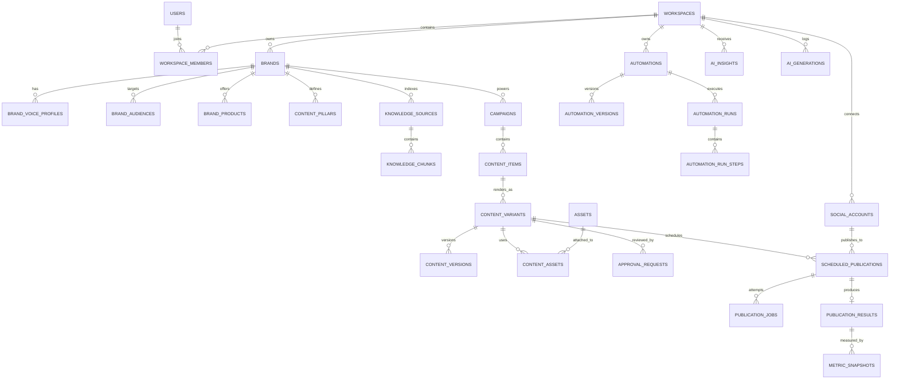

# SoStats — AI Content Automation Platform
Product Architecture, Database Design & Stage-by-Stage Implementation Plan

Document purpose: Define SoStats as a scalable AI Content Automation platform, based on the approved UI direction: Home, AI Studio, Content, Calendar, Automations, Analytics, Media, Channels, Brand Brain, Integrations, and Settings.

## Primary goals
- AI-first content lifecycle: Idea → Generate → Review → Schedule → Publish → Measure → Learn → Generate again
- Multi-channel social publishing without hard-coding providers into the core domain
- Clean separation of Frontend / Backend / AI / Workers
- Hexagonal architecture so providers can be plugged/replaced through adapters
- Multi-tenant by design
- Start simple enough to ship, but keep clear seams for later horizontal scaling

## 1. Product Definition
### 1.1 Core product loop
```
Brand Brain
    ↓
AI Studio → Campaign
    ↓
Content Pipeline
    ↓
Review / Approval
    ↓
Calendar / Scheduling
    ↓
Channel Adapters
    ↓
Social Platforms
    ↓
Analytics Ingestion
    ↓
AI Insights
    ↓
Recommended Actions
    └──────────────→ AI Studio / Automations
```
The important product principle is that analytics does not end in a report. Analytics must produce an actionable feedback loop that can create the next campaign, update recommendations, or trigger an automation.

## 2. Page-by-Page Feature Breakdown
### 2.1 Home
**Purpose**
The operating dashboard for the entire workspace.

**UI blocks**
- Global search
- + Create
- Greeting / workspace status
- AI command bar
- KPI cards
  - Content Created
  - Scheduled
  - Published
  - AI Time Saved
- Content Queue
  - Draft
  - Review
  - Scheduled
  - Published
- AI Recommendations
- Channel Performance
- Upcoming Content Calendar
- Automation Activity
- Recent Campaigns
- Latest Assets

**Key actions**
- Start a campaign from a natural-language prompt
- Open items that need review
- Jump to content with performance anomalies
- Accept an AI recommendation
- Open upcoming scheduled content
- Inspect recent automation runs

**Backend dependencies**
- Content
- Campaign
- Scheduling
- Analytics
- Automation
- AI Insight
- Media
- Social Channel

**Important rule**
Home does not own data. It is an aggregation/read-model over other modules.

### 2.2 AI Studio
**Purpose**
The AI campaign and content-generation workspace.

**Inputs**
- Campaign brief
- Goal
- Target audience
- Selected channels
- Tone of voice
- Asset preferences
- Brand Brain context
- Optional source URLs / documents / media

**Outputs**
- Campaign strategy
- Content pillars
- Post ideas
- Short-video ideas
- Generated posts
- Generated images/video requests
- Suggested publishing schedule

**Tabs**
- Strategy
- Posts
- Images
- Video

**Quick templates**
- Product Launch
- Weekly Content Plan
- Repurpose Blog Post
- Trend-Based Content

**Core flow**
```
Prompt
  ↓
Resolve Brand Context
  ↓
Generate Structured Campaign Plan
  ↓
Validate JSON schema
  ↓
Persist Campaign
  ↓
Generate Content Items
  ↓
Create Channel Variants
  ↓
Attach / Generate Media
  ↓
Send to Content Pipeline
```
AI Studio should never publish directly by default
It creates domain objects. Publishing remains the responsibility of scheduling/publishing modules.

### 2.3 Content
**Purpose**
The central lifecycle manager for all content.

**Views**
- Board
- List
- Campaign

**Pipeline columns**
- Ideas
- Drafts
- Review
- Scheduled
- Published

**Optional later states:**
- Rejected
- Failed
- Archived

**Features**
- Drag/drop state transition
- Search
- Filters
  - Channel
  - Campaign
  - Status
  - Owner
  - Date range
- Bulk actions
- AI Generate
- Create manually
- Edit platform variants
- Assign reviewer
- Attach assets
- Duplicate / repurpose
- Open analytics after publication

**Important domain concept**
A Content Item is the canonical idea/story.
A Content Variant is the platform-specific rendering.

**Example:**
```
Content Item: "Launch announcement"
  ├─ LinkedIn Variant
  ├─ X Variant
  ├─ Instagram Variant
  ├─ TikTok Variant
  └─ Facebook Variant
```
This prevents duplicating the business concept across channels.

### 2.4 Calendar
**Purpose**
Visual scheduling and publishing control.

**Views**
- Month
- Week
- Day

**Features**
- Filter channels
- Drag to reschedule
- Quick create
- Open slot detection
- Campaign overlay
- Pending approvals
- Coverage indicator
- Post side panel
- Edit
- Duplicate
- Reschedule
- Approve / reject
- Show channel-specific variant
- Media preview

**Scheduling rule**
Calendar entries point to scheduled_publications, not directly to the content item.
One content item may have multiple channel publications at different times.

### 2.5 Automations
**Purpose**
Build repeatable content operations.

**Templates**
- Blog → Social
- Weekly Content Plan
- New YouTube Video
- Product Launch Sequence
- Trend Monitor

**Workflow nodes**
Initial node types:
*Triggers*
- Schedule
- Webhook
- RSS new item
- New blog post
- New YouTube video
- Manual
- Analytics threshold
- New campaign item

*AI / transformation*
- Generate posts
- Rewrite for channel
- Summarize
- Extract highlights
- Generate image brief
- Generate image
- Generate hashtags
- Classify
- Analyze performance

*Control*
- If/Else
- Delay
- Wait for approval
- Branch by channel
- Stop

*Actions*
- Create content
- Send for review
- Schedule
- Publish
- Notify
- Write to campaign

**Builder layout**
- Template list left
- Node canvas center
- Node configuration right
- Run history bottom

**Important architecture rule**
The automation module orchestrates application use cases through ports. It must not directly call provider SDKs.

### 2.6 Analytics
**Purpose**
Turn social performance data into decisions.

**Metrics**
- Reach
- Engagement
- Clicks
- Published posts
- Impressions
- Saves
- Shares
- Comments
- Video watch metrics when supported

**UI**
- Date range
- Channel filters
- KPI cards
- Performance trend
- Channel comparison
- Top content
- Best posting times
- Audience response patterns
- AI Insights

**AI Insight examples**
- Short-form video performs 2.3x better
- Tuesday/Thursday posts outperform baseline
- Educational content drives more saves
- Recommend generating 3 follow-up posts

**Feedback-loop action**
Each recommendation should be actionable:
- Create more
- Adjust schedule
- Create campaign
- Repurpose winner

### 2.7 Media
**Purpose**
Central asset repository.

**Asset types**
- Images
- Videos
- Templates
- Brand assets
- Generated assets

**Features**
- Collections
- Tags
- Search
- Filters
- Preview
- Metadata
- Usage history
- Related campaign
- Channel usage
- Upload
- AI Generate Asset
- Use in AI Studio

**Storage strategy**
Binary data goes to S3-compatible object storage.
Database stores metadata and relations only.

### 2.8 Channels
**Purpose**
Manage social provider connections and distribution rules.

**Initial providers**
- LinkedIn
- X
- TikTok
- Instagram
- Facebook
- YouTube

**Features**
- Connected status
- Permission health
- Last sync
- Token expiry
- Reconnect
- Channel performance snapshot
- Queue summary
- Publishing adaptation rules
- Channel health

**Provider adapter pattern**
```
SocialChannelPort
        |
        +-- LinkedInAdapter
        +-- MetaAdapter
        +-- XAdapter
        +-- TikTokAdapter
        +-- YouTubeAdapter
```
Adding a platform should not require changes to Content, Calendar, AI, or Analytics domain logic.

### 2.9 Brand Brain
**Purpose**
The shared context used by every AI workflow.

**Sections**
- Brand Voice
- Audience
- Products
- Content Pillars
- CTA Style
- Banned Words
- Competitors
- Good Examples
- Brand Assets
- Knowledge Sources

**RAG sources**
- Website pages
- Documents
- Product docs
- URLs
- Previous approved content
- Brand guidelines

**AI usage**
Every AI request receives a compact brand context assembled by the AI service.
Do not inject the entire Brand Brain on every prompt.
Retrieve only relevant chunks.

### 2.10 Integrations
**Purpose**
External non-social sources and actions.

**Examples:**
- WordPress
- Webhooks
- RSS
- Google Drive later
- Slack later
- Notion later
- Shopify later
- CMS connectors

Integrations use the same adapter registry pattern as channels.

### 2.11 Settings
**Sections**
- Workspace
- Team
- Roles
- Notifications
- API keys
- Webhooks
- AI preferences
- Data retention
- Security
- Audit logs

No Upgrade / Pro / billing UI in the current product design.

## 3. How Pages Sync Together
### 3.1 Campaign generation path
```
AI Studio
  → Campaign created
  → Content Items generated
  → Channel Variants generated
  → Content board shows Drafts
  → Reviewer approves
  → Calendar schedules each Variant
  → Publisher Worker sends to Channel Adapter
  → Publication Result saved
  → Analytics Worker collects metrics
  → AI Insight engine produces recommendations
  → Home displays recommendations
```

### 3.2 Automation path
```
Trigger
  → Automation Run
  → AI generation node
  → Content Item + Variants
  → Approval node
  → Schedule node
  → Publication job
  → Provider adapter
  → Analytics ingestion
```

### 3.3 Brand Brain path
```
Knowledge Source
  → Parse
  → Chunk
  → Embed
  → Store vector
  → Retrieve relevant context
  → AI Studio / Automations / Recommendations
```

## 4. Recommended Technical Architecture
### 4.1 Deployment boundaries
Use a monorepo initially, but make these independently deployable:
```
sostats/
├─ apps/
│  ├─ web/                 # Next.js + shadcn/ui
│  ├─ api/                 # NestJS + Fastify
│  ├─ ai/                  # Python FastAPI
│  ├─ worker/              # background jobs
│  └─ scheduler/           # optional separate scheduler runtime
├─ packages/
│  ├─ contracts/           # OpenAPI schemas / shared generated types
│  ├─ ui/                  # shared shadcn-based UI
│  ├─ config/
│  ├─ observability/
│  └─ testing/
├─ infra/
│  ├─ docker/
│  ├─ terraform/
│  └─ k8s/                 # later, not required for MVP
└─ docs/
```
**Why monorepo first**
- Faster feature development
- Atomic contract changes
- Shared CI
- Still clean enough to split later

**Rule**
Services may depend on contracts; they must not import each other's implementation code.

## 5. Backend Hexagonal Architecture
Each domain module follows:
```
module/
├─ domain/
│  ├─ entities/
│  ├─ value-objects/
│  ├─ events/
│  └─ policies/
├─ application/
│  ├─ use-cases/
│  ├─ commands/
│  ├─ queries/
│  └─ dto/
├─ ports/
│  ├─ inbound/
│  └─ outbound/
└─ adapters/
   ├─ inbound/
   │  ├─ http/
   │  └─ events/
   └─ outbound/
      ├─ persistence/
      ├─ providers/
      └─ queue/
```

### 5.1 Recommended backend modules
- Identity
- Workspace
- Brand
- Campaign
- Content
- Media
- Channel
- Scheduling
- Publishing
- Automation
- Analytics
- Recommendation
- Notification
- Integration
- Audit

## 6. Core Ports and Adapters
### 6.1 Social provider port
```typescript
interface SocialPublisherPort {
  validateConnection(accountId: string): Promise<ConnectionHealth>;
  publish(input: PublishInput): Promise<PublishResult>;
  update?(input: UpdatePublishInput): Promise<PublishResult>;
  delete?(externalPostId: string): Promise<void>;
  fetchMetrics(input: MetricsQuery): Promise<MetricPoint[]>;
}
```
**Adapters:**
- LinkedInPublisherAdapter
- MetaPublisherAdapter
- XPublisherAdapter
- TikTokPublisherAdapter
- YouTubePublisherAdapter

### 6.2 AI provider port
```typescript
interface LlmPort {
  generateStructured<T>(input: StructuredGenerationInput<T>): Promise<T>;
  generateText(input: TextGenerationInput): Promise<string>;
  embed(input: string[]): Promise<number[][]>;
}
```
**Adapters:**
- OpenAIAdapter
- AnthropicAdapter
- GeminiAdapter
- LocalModelAdapter later

AI business logic must never import a provider SDK directly.

### 6.3 Object storage port
```typescript
interface ObjectStoragePort {
  createUploadUrl(input: UploadRequest): Promise<SignedUpload>;
  createDownloadUrl(key: string): Promise<string>;
  delete(key: string): Promise<void>;
}
```
**Adapters:**
- S3
- R2
- MinIO for local development

### 6.4 Workflow engine port
```typescript
interface WorkflowEnginePort {
  start(workflowId: string, input: unknown): Promise<string>;
  resume(runId: string, input?: unknown): Promise<void>;
  cancel(runId: string): Promise<void>;
}
```
**Initial adapter:**
- DB state machine + BullMQ

**Future adapter:**
- Temporal

This keeps the domain independent of the workflow runtime.

## 7. Frontend Architecture
### 7.1 Stack
- Next.js App Router
- TypeScript
- Tailwind CSS
- shadcn/ui
- TanStack Query
- React Hook Form
- Zod
- dnd-kit for content board/calendar drag interactions
- React Flow for automation builder
- Recharts through shadcn chart primitives
- Generated API client from OpenAPI

### 7.2 Route structure
```
/app
  /(auth)
  /(workspace)/[workspaceSlug]/
    page.tsx                     # Home
    /ai-studio
    /content
    /calendar
    /automations
    /analytics
    /media
    /channels
    /brand-brain
    /integrations
    /settings
```

### 7.3 shadcn component mapping
**Use:**
- Button
- Card
- Tabs
- Badge
- Dialog
- Sheet
- Drawer
- DropdownMenu
- Popover
- Command
- Calendar
- Select
- Input
- Textarea
- Table
- Tooltip
- Progress
- Skeleton
- Toast/Sonner
- Form
- Alert
- Avatar

**Custom composites:**
- KpiCard
- ChannelBadge
- ContentCard
- CampaignCard
- ContentBoard
- ScheduleGrid
- AiPromptBox
- WorkflowNode
- AssetCard
- InsightCard

Keep primitives in packages/ui; keep product composites inside the web app.

## 8. AI Service Architecture
### 8.1 Responsibilities
The AI service owns:
- Prompt assembly
- Brand context retrieval
- Structured generation
- RAG
- Model routing
- Prompt versioning
- AI evaluation
- Guardrails
- Content transformation
- Recommendation generation

It does not own:
- Workspace authorization
- Social OAuth tokens
- Scheduling
- Publishing
- Final persistence rules

### 8.2 AI endpoints
- POST /v1/campaigns/plan
- POST /v1/content/generate
- POST /v1/content/adapt
- POST /v1/content/repurpose
- POST /v1/brand/context
- POST /v1/insights/generate
- POST /v1/media/brief
- POST /v1/embeddings/index

Prefer asynchronous jobs for expensive generation.

### 8.3 Structured output examples
**CampaignPlan**
- title
- objective
- audience
- channels
- duration
- contentPillars[]
- contentIdeas[]
- videoIdeas[]
- scheduleSuggestions[]

**ChannelVariantDraft**
- channel
- hook
- body
- cta
- hashtags
- mediaBrief
- metadata

## 9. Database
### 9.1 Database choice
PostgreSQL as system of record.
Extensions:
- pgcrypto
- pgvector

Optional later:
- TimescaleDB for high-volume metrics
- ClickHouse when analytics volume justifies it

## 10. Core Database Tables
### 10.1 Identity & tenancy
**users**
- id UUID PK
- email
- display_name
- avatar_url
- created_at
- updated_at

**workspaces**
- id UUID PK
- name
- slug
- timezone
- created_at
- updated_at

**workspace_members**
- workspace_id FK
- user_id FK
- role
- status
- joined_at

Unique: `workspace_id + user_id`
Every business table must include `workspace_id`.

### 10.2 Brand Brain
**brands**
- id
- workspace_id
- name
- description
- website_url
- default_language

**brand_voice_profiles**
- id
- brand_id
- traits JSONB
- guidelines TEXT
- examples TEXT
- updated_at

**brand_audiences**
- id
- brand_id
- name
- description
- interests JSONB

**brand_products**
- id
- brand_id
- name
- description
- metadata JSONB

**content_pillars**
- id
- brand_id
- name
- description
- priority

**brand_rules**
- id
- brand_id
- rule_type
- value
- metadata JSONB

`rule_type` examples:
- banned_word
- preferred_cta
- forbidden_topic

**knowledge_sources**
- id
- brand_id
- type
- title
- source_url
- asset_id nullable
- status
- checksum
- indexed_at

**knowledge_chunks**
- id
- source_id
- chunk_index
- content
- embedding VECTOR
- metadata JSONB

### 10.3 Campaign
**campaigns**
- id
- workspace_id
- brand_id
- name
- objective
- status
- start_at
- end_at
- brief
- created_by
- created_at
- updated_at

**campaign_channels**
- campaign_id
- social_account_id

**campaign_pillars**
- campaign_id
- content_pillar_id
- sort_order

### 10.4 Content
**content_items**
Canonical content concept.
- id
- workspace_id
- campaign_id nullable
- brand_id
- title
- content_type
- lifecycle_status
- source_type
- owner_id
- created_by
- created_at
- updated_at

Statuses: idea, draft, review, scheduled, published, rejected, archived

**content_variants**
Platform-specific content.
- id
- content_item_id
- social_account_id
- channel_type
- text
- title nullable
- metadata JSONB
- generation_source
- version
- status
- created_at
- updated_at

**content_versions**
- id
- content_variant_id
- version
- snapshot JSONB
- created_by
- created_at

**content_assets**
- content_variant_id
- asset_id
- role
- sort_order

**content_tags**
- content_item_id
- tag_id

**tags**
- id
- workspace_id
- name

### 10.5 Review / approval
**approval_requests**
- id
- workspace_id
- content_variant_id
- requested_by
- assigned_to
- status
- requested_at
- resolved_at
- comment

### 10.6 Media
**assets**
- id
- workspace_id
- brand_id nullable
- type
- storage_key
- mime_type
- file_name
- file_size
- width nullable
- height nullable
- duration_ms nullable
- source
- metadata JSONB
- created_by
- created_at

**asset_collections**
- id
- workspace_id
- name

**asset_collection_items**
- collection_id
- asset_id

**asset_tags**
- asset_id
- tag_id

### 10.7 Channels
**social_accounts**
- id
- workspace_id
- provider
- external_account_id
- name
- handle
- account_type
- status
- token_ref
- token_expires_at
- permissions JSONB
- metadata JSONB
- last_synced_at
- created_at

Never store raw OAuth tokens in ordinary plaintext columns.
Use encrypted secret storage or envelope encryption.

**channel_rules**
- id
- social_account_id
- rules JSONB
- updated_at

### 10.8 Scheduling & publishing
**scheduled_publications**
- id
- workspace_id
- content_variant_id
- social_account_id
- scheduled_at
- timezone
- status
- approval_required
- created_at
- updated_at

Statuses: pending, queued, publishing, published, failed, cancelled

**publication_jobs**
- id
- scheduled_publication_id
- queue_job_id
- attempt
- status
- error_code
- error_message
- started_at
- finished_at

**publication_results**
- id
- scheduled_publication_id
- provider
- external_post_id
- external_url
- published_at
- provider_response JSONB

### 10.9 Automations
**automations**
- id
- workspace_id
- name
- description
- status
- trigger_type
- created_by
- current_version_id
- created_at

**automation_versions**
- id
- automation_id
- version
- definition JSONB
- created_at
- published_at

The graph definition can remain JSONB initially.
Example:
```json
{
  "nodes": [],
  "edges": []
}
```

**automation_runs**
- id
- automation_id
- version_id
- status
- trigger_payload JSONB
- started_at
- finished_at

**automation_run_steps**
- id
- run_id
- node_id
- node_type
- status
- input JSONB
- output JSONB
- error JSONB
- started_at
- finished_at

### 10.10 Analytics
**metric_snapshots**
- id
- workspace_id
- social_account_id
- publication_result_id
- captured_at
- impressions
- reach
- likes
- comments
- shares
- saves
- clicks
- video_views
- watch_time_ms
- provider_metrics JSONB

Index heavily by: `workspace_id`, `captured_at`, `social_account_id`, `publication_result_id`

**analytics_daily**
Materialized / derived rollup.
- workspace_id
- social_account_id
- date
- impressions
- reach
- engagement
- clicks
- published_count

**ai_insights**
- id
- workspace_id
- scope_type
- scope_id nullable
- insight_type
- title
- summary
- evidence JSONB
- recommendation JSONB
- confidence
- status
- generated_at

### 10.11 AI traceability
**ai_generations**
- id
- workspace_id
- operation_type
- provider
- model
- prompt_version
- input_hash
- input_metadata JSONB
- output_metadata JSONB
- tokens_input
- tokens_output
- latency_ms
- status
- created_at

Store prompt templates in code/version control or a dedicated prompt registry.
Do not store secrets inside generation logs.

### 10.12 Integrations / webhooks
**integrations**
- id
- workspace_id
- provider
- type
- status
- config_encrypted
- created_at

**webhook_endpoints**
- id
- workspace_id
- url
- secret_ref
- events JSONB
- enabled

**webhook_deliveries**
- id
- endpoint_id
- event_type
- payload JSONB
- status
- attempts
- last_attempt_at

### 10.13 Audit
**audit_logs**
- id
- workspace_id
- actor_user_id nullable
- actor_type
- action
- resource_type
- resource_id
- metadata JSONB
- created_at

## 11. ER Relationship Diagram


## 12. API Design
Use REST + OpenAPI initially.
**Why:**
- Clear BE/FE separation
- Generated clients
- Easy external API later
- Easy contract tests

**Example endpoints:**
```
GET    /v1/workspaces/:id/home
POST   /v1/campaigns
GET    /v1/campaigns/:id
POST   /v1/campaigns/:id/generate

GET    /v1/content
POST   /v1/content
PATCH  /v1/content/:id/status
POST   /v1/content/:id/repurpose

GET    /v1/calendar
POST   /v1/schedules
PATCH  /v1/schedules/:id

GET    /v1/automations
POST   /v1/automations
POST   /v1/automations/:id/run

GET    /v1/analytics/overview
GET    /v1/analytics/content/:contentId

GET    /v1/assets
POST   /v1/assets/upload-url

GET    /v1/channels
POST   /v1/channels/:provider/connect

GET    /v1/brand-brain
PATCH  /v1/brand-brain/:section
POST   /v1/knowledge-sources
```
Use SSE or WebSocket only for:
- generation progress
- workflow run progress
- publishing state
- real-time notifications
Normal CRUD remains HTTP.

## 13. Domain Events
Publish internal events after committed state changes:
- `campaign.created`
- `campaign.generated`
- `content.created`
- `content.variant.created`
- `content.submitted_for_review`
- `content.approved`
- `content.scheduled`
- `publication.queued`
- `publication.succeeded`
- `publication.failed`
- `analytics.metrics_ingested`
- `analytics.insight_generated`
- `automation.started`
- `automation.step_completed`
- `automation.completed`
- `automation.failed`
- `asset.created`
- `knowledge.indexed`

Use an Outbox table to avoid losing events between DB commit and queue publish.

## 14. Event Infrastructure
**MVP**
- PostgreSQL
- Redis
- BullMQ

**Scale-up**
- Add NATS JetStream or Kafka when cross-service event volume justifies it
- Keep event publisher behind a port

Do not begin with Kafka unless volume requires it.

## 15. Multi-Tenancy & Security
Required from Stage 0:
- `workspace_id` on all tenant-owned tables
- tenant check in every use case
- database indexes include workspace
- encrypted OAuth credentials
- signed upload URLs
- webhook signature verification
- API rate limiting
- audit trail for publish/delete/reconnect operations
- role-based permissions

Roles: owner, admin, editor, reviewer, viewer
Potential PostgreSQL RLS can be added after the access model is stable.

## 16. Scalability Strategy
**Start**
One API deployment, one AI service, one worker service.
```
Web
 ↓
API
 ├─ PostgreSQL
 ├─ Redis
 ├─ Object Storage
 ├─ AI Service
 └─ Queue → Worker
```

**Later**
Scale each workload independently:
```
Web CDN / Edge
      ↓
API replicas
      ↓
Postgres Primary + Read Replica

Queue
 ├─ Publishing Workers
 ├─ AI Workers
 ├─ Analytics Workers
 ├─ Media Workers
 └─ Automation Workers

AI Service replicas
Object Storage
Analytics Store / ClickHouse
```

**Important**
Do not split every domain into microservices early.
Hexagonal boundaries make later extraction possible without paying microservice complexity on day one.

## 17. Observability
Use:
- OpenTelemetry
- structured JSON logs
- traces across API → queue → worker → AI/provider
- Sentry for FE/BE errors
- Prometheus-compatible metrics

Track:
- publish success rate
- provider latency
- provider error rate
- queue depth
- AI generation latency
- AI failure rate
- token usage
- automation success rate
- analytics sync lag

Every background job gets a `correlation_id`.

## 18. Recommended Repository Structure
```
sostats/
├─ apps/
│  ├─ web/
│  │  ├─ app/
│  │  ├─ components/
│  │  ├─ features/
│  │  └─ lib/
│  │
│  ├─ api/
│  │  └─ src/
│  │     ├─ modules/
│  │     │  ├─ workspace/
│  │     │  ├─ brand/
│  │     │  ├─ campaign/
│  │     │  ├─ content/
│  │     │  ├─ media/
│  │     │  ├─ channel/
│  │     │  ├─ scheduling/
│  │     │  ├─ publishing/
│  │     │  ├─ automation/
│  │     │  ├─ analytics/
│  │     │  └─ recommendation/
│  │     └─ shared/
│  │
│  ├─ ai/
│  │  ├─ app/
│  │  │  ├─ api/
│  │  │  ├─ pipelines/
│  │  │  ├─ rag/
│  │  │  ├─ providers/
│  │  │  ├─ prompts/
│  │  │  └─ evals/
│  │  └─ tests/
│  │
│  └─ worker/
│     └─ src/
│        ├─ publishing/
│        ├─ analytics/
│        ├─ media/
│        └─ automation/
│
├─ packages/
│  ├─ contracts/
│  ├─ ui/
│  ├─ config/
│  ├─ observability/
│  └─ testing/
│
├─ db/
│  ├─ migrations/
│  └─ seeds/
│
├─ infra/
├─ docs/
└─ .github/workflows/
```

## 19. Stage-by-Stage Implementation Plan
### Stage 0 — Engineering Foundation
**Goal**
Create a deployable skeleton with boundaries that will not need to be rewritten.

**FE**
- Next.js
- Tailwind
- shadcn/ui
- App shell
- Sidebar
- top bar
- route placeholders
- theme tokens

**BE**
- NestJS + Fastify
- Config
- validation
- OpenAPI
- PostgreSQL
- Drizzle ORM
- migrations
- auth middleware
- workspace context

**AI**
- FastAPI skeleton
- health endpoint
- provider interface
- one model adapter
- structured response helper

**Infra**
- Docker Compose
- Postgres
- Redis
- MinIO
- local mail catcher
- CI lint/test/build

**Exit criteria**
- Web can call API
- API can call AI
- migrations work
- local stack starts with one command
- deployment environments defined

### Stage 1 — Identity, Workspace & Brand Brain Base
**Build**
- User, Workspace, Membership, Roles
- Brand, Brand Voice, Audience, Products
- Content Pillars, CTA rules, Banned words

**UI**
Build Brand Brain page first because AI depends on it.

**AI**
- context assembler
- brand profile schema
- prompt context compaction

**Exit criteria**
AI can generate a sample post that respects stored brand rules.

### Stage 2 — Channels & Provider Adapter Framework
**Build**
- Social account table
- OAuth connection lifecycle
- Provider registry
- encrypted tokens
- refresh logic
- health check

**First real adapter**
Implement one provider end-to-end first.
Recommended: LinkedIn or Meta, depending on the APIs you can access fastest
Then add the other adapters.

**Exit criteria**
A test content payload can publish through a provider adapter in a controlled environment.

### Stage 3 — Media Library
**Build**
- presigned upload
- metadata
- collections
- tags
- preview
- delete
- asset usage

**Worker**
- image dimensions
- video duration
- thumbnail generation

**Exit criteria**
Assets can be uploaded, browsed, tagged, and attached to content.

### Stage 4 — Content Core
**Build**
- Content Item, Content Variant, Versions
- Content board, List, Campaign view
- Review workflow, bulk actions

**FE**
Use dnd-kit for pipeline movement.

**Exit criteria**
Users can create and manage a complete content lifecycle manually without AI.
This is important: AI must enhance a working domain, not compensate for missing domain logic.

### Stage 5 — AI Studio v1
**Build**
- campaign prompt, goal, audience, channels, tone
- campaign strategy, pillars, post ideas, platform variants

**AI**
- structured campaign generation
- brand retrieval
- content adaptation
- validation
- retries

**Persistence**
AI output becomes real Campaign / Content / Variant rows.

**Exit criteria**
One prompt can produce a campaign and populate the Content board.

### Stage 6 — Calendar & Scheduling
**Build**
- month/week/day calendar
- channel filter
- schedule, reschedule, open slots
- detail sheet, timezone handling

**Backend**
Scheduling service remains provider-agnostic.

**Exit criteria**
Approved content variants can be placed on a calendar and queued at the correct workspace time.

### Stage 7 — Publishing Worker
**Build**
- delayed jobs, retries, idempotency
- provider rate limits
- failure reason, dead-letter queue
- publication result

**Important**
Use idempotency keys so a retry cannot publish the same post twice.

**Exit criteria**
Scheduled content reliably reaches connected channels and stores external IDs.

### Stage 8 — Automations v1
**Build workflow engine**
Start with: Trigger, Generate Posts, Create Images, Review, Schedule, Publish, Analyze

**UI**
- React Flow, node drawer, config panel
- test run, history

**Runtime**
Persist every run and every step.

**Exit criteria**
A Blog → Social workflow can execute end-to-end.

### Stage 9 — Analytics Ingestion
**Build**
- provider metric collectors
- scheduled sync, backoff, checkpointing
- metric snapshots, daily rollups

**UI**
- KPI, trends, comparison
- top content, best posting times

**Exit criteria**
Published content is linked to provider performance data.

### Stage 10 — AI Insights / Closed Loop
**AI inputs**
- campaign, content type, channel
- publication metrics, historical baseline, brand goals

**Outputs**
- insight, evidence, recommended action, confidence

**UI**
Action buttons: Create more, Repurpose, Adjust schedule, Create campaign

**Exit criteria**
Analytics can trigger a user-approved content action.
This completes the core SoStats product loop.

### Stage 11 — Home Dashboard
Now build the dashboard from real read models.

**Sections**
- KPIs, Content Queue, Recommendations
- Channel Performance, Calendar preview
- Automation activity, Campaigns, Assets

**Why late**
If Home is built early, it becomes mocked UI.
If built here, every widget has a real source of truth.

### Stage 12 — Knowledge Sources / RAG
**Build**
- URL ingestion, document ingestion
- parsing, chunking, embedding, retrieval
- source freshness

**AI**
Use retrieval filters: workspace, brand, source, recency, content pillar

**Exit criteria**
AI can cite/use internal brand knowledge without sending every document to the model.

### Stage 13 — Integration Framework
Implement: Webhook adapter, RSS adapter, WordPress adapter
Then later: Notion, Drive, Shopify, Slack

Reuse a registry:
```typescript
integrationRegistry.register("wordpress", wordpressAdapter);
integrationRegistry.register("rss", rssAdapter);
```

### Stage 14 — Hardening & Scale
**Security**
- rotate credentials, tenant isolation tests
- OAuth token protection, webhook verification
- API abuse limits

**Reliability**
- job idempotency, event outbox
- retry policy, dead-letter queues
- provider circuit breakers

**Performance**
- DB index review, pagination, caching
- aggregate tables, precomputed dashboard read models

**Observability**
- SLOs, traces, alerts, queue lag dashboards

## 20. Testing Strategy
- **FE**: Vitest, Testing Library, Playwright E2E
- **BE**: unit tests for domain, use-case tests, adapter integration tests, API contract tests
- **AI**: schema validation tests, prompt golden set, regression evals, brand consistency eval, hallucination checks, provider fallback tests
- **Provider adapters**: Create a contract test suite all adapters must pass.
  - Example: `validateConnection`, `publish text post`, `publish with media`, `normalize provider error`, `fetch metrics`, `refresh credentials`

## 21. Provider Plugin Contract
Each provider package should expose metadata and capabilities.
```typescript
type ProviderCapabilities = {
  text: boolean;
  images: boolean;
  video: boolean;
  carousel: boolean;
  scheduling: boolean;
  analytics: boolean;
  editPublished: boolean;
};

interface SocialProviderPlugin {
  key: string;
  capabilities: ProviderCapabilities;
  oauth: OAuthAdapter;
  publisher: SocialPublisherPort;
  analytics: SocialAnalyticsPort;
}
```
The UI can use capabilities to automatically hide unsupported features.

## 22. Important Product Rules
1. Canonical content is separate from channel variants.
2. AI does not bypass approvals/publishing policies.
3. Scheduling does not know provider SDK details.
4. Provider adapters do not contain business workflow logic.
5. Home is a read-model, not a source of truth.
6. Analytics is linked to exact publication results.
7. Automation runs are fully persisted.
8. Every tenant resource is workspace-scoped.
9. Every AI generation is traceable by prompt/model/version.
10. Every external side effect is idempotent.

## 23. MVP Scope Recommendation
For the first usable release:
**Include**
- Workspace/team, Brand Brain basic
- 2 social providers, Media Library
- AI Studio, Content board, Review
- Calendar, Scheduling, Reliable publishing
- Basic analytics, 3 automation templates
- AI recommendations

**Delay**
- complex multi-branch automations, all social networks
- advanced video editor, dedicated data warehouse
- Kafka, Kubernetes, dozens of third-party integrations
- real-time collaborative editing

The architecture keeps room for them without forcing their complexity into MVP.

## 24. Definition of "Ready to Scale"
SoStats is scale-ready when:
- services are stateless where possible
- external providers are behind ports
- AI providers are behind ports
- jobs are idempotent
- tenant context is enforced
- queues isolate slow work
- database has clear ownership
- events use transactional outbox
- APIs have explicit contracts
- workers can scale horizontally
- metrics can move to a specialized analytics store without rewriting product domains

Scale-ready does not mean starting with dozens of microservices.

## 25. Recommended Build Order Summary
0. Foundation
1. Identity + Workspace + Brand Brain
2. Channel Adapter Framework
3. Media
4. Content Core
5. AI Studio
6. Calendar + Scheduling
7. Publishing Worker
8. Automations
9. Analytics
10. AI Insights
11. Home Dashboard
12. RAG / Knowledge
13. Integrations
14. Hardening / Scale

## 26. Final Architecture Snapshot
```
                         ┌─────────────────────┐
                         │ Next.js Web         │
                         │ shadcn/ui           │
                         └──────────┬──────────┘
                                    │ OpenAPI
                                    ▼
                         ┌─────────────────────┐
                         │ API / Application   │
                         │ NestJS + Fastify    │
                         │ Hexagonal Modules   │
                         └─────┬──────┬────────┘
                               │      │
                         SQL   │      │ async jobs/events
                               ▼      ▼
                       ┌──────────┐  ┌─────────────┐
                       │Postgres  │  │ Redis/Queue │
                       │pgvector  │  └──────┬──────┘
                       └──────────┘         │
                                            ▼
                                 ┌──────────────────┐
                                 │ Worker Runtimes  │
                                 │ publish          │
                                 │ automation       │
                                 │ analytics        │
                                 │ media            │
                                 └──────┬───────────┘
                                        │
               ┌────────────────────────┼─────────────────────┐
               │                        │                     │
               ▼                        ▼                     ▼
        Social Adapters             AI Service           Object Storage
        LinkedIn / Meta             FastAPI              S3 / R2
        X / TikTok / YT             RAG + Models
```
This gives SoStats clear separation between product domains and infrastructure, while keeping the first production version practical to build.